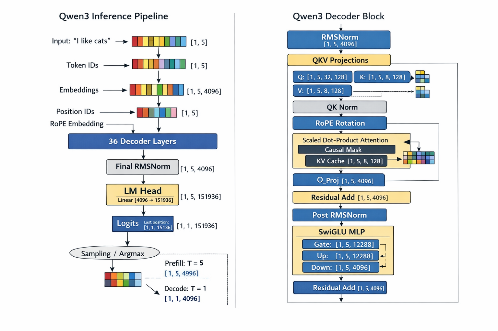

# Lab 2

The goal of Lab 2 is to keep the simple generation engine from Lab 1, but replace the Hugging Face model implementation with a small hand-written Qwen3 forward pass.

This lab is still not about throughput, scheduling, or a production runtime. The new objective is to understand what the model is actually doing during inference:
- build the transformer layers directly in PyTorch
- load weights from safetensors
- run the same token-by-token generation loop end to end
- keep the engine structure simple enough to inspect

In this repository, Lab 2 should be understood as a "manual model implementation" lab:
- Single-request generation
- Synchronous execution
- Full forward pass at every decoding step
- No KV cache
- No batching
- No continuous batching
- No memory management

## What You Will Build

From the API point of view, Lab 2 still supports an interface like this:

```python
llm = LLMEngine(model_path)
outputs = llm.generate(
    ["introduce yourself"],
    SamplingParams(temperature=0.6, max_tokens=32),
)
```

The difference is under the hood. Instead of calling `AutoModelForCausalLM`, Lab 2 builds the model pieces directly:
1. Load the Qwen config
2. Construct embedding, attention, MLP, RMSNorm, and LM head modules
3. Load checkpoint weights from `.safetensors`
4. Run the handwritten forward pass and sample the next token

## Suggested Module Split

### 1. `Sequence`

Responsibility: store request state exactly like Lab 1.

The runtime loop is still driven by a request object that holds:
- `token_ids`
- `last_token`
- `num_tokens`
- `num_prompt_tokens`
- `temperature`
- `max_tokens`
- `ignore_eos`

This is intentionally unchanged. Lab 2 is about the model internals, not about changing request management yet.

### 2. Core Layers

Responsibility: implement the minimal building blocks needed by Qwen3.

The important layer files are:
- `embed_head.py`
- `linear.py`
- `rmsNorm.py`
- `rotary_embedding.py`
- `attention.py`
- `activation.py`
- `sampler.py`

Each one should stay narrow and easy to reason about:
- `Embedding` maps token ids to hidden vectors
- `LMHead` maps hidden vectors back to vocabulary logits
- `Linear`, `MergedLinear`, and `QKVLinear` define the projection layers
- `RMSNorm` handles normalization
- `RotaryEmbedding` applies RoPE to query and key
- `Attention` runs scaled dot-product attention
- `SiluAndMul` implements the gated MLP activation
- `Sampler` turns final logits into one sampled token

### 3. `Qwen3ForCausalLM`

Responsibility: assemble the full model from the smaller layers.

The main hierarchy is:
- `Qwen3Attention`
- `Qwen3MLP`
- `Qwen3DecoderLayer`
- `Qwen3Model`
- `Qwen3ForCausalLM`

This is the most important conceptual shift from Lab 1. You are no longer treating the model as a black box. You are rebuilding the forward graph yourself.

### 4. Weight Loader

Responsibility: load checkpoint tensors into the custom module layout.

In Lab 2, the parameter names in the checkpoint do not always match the exact module names in the hand-written model. For example:
- Q, K, and V are packed into one `qkv_proj`
- gate and up projections are packed into one `gate_up_proj`

So the loader has to:
- open `.safetensors` files
- map checkpoint tensor names to local parameter names
- copy shards into packed weights

This introduces an important runtime idea: model execution code and checkpoint layout are related, but not always identical.

### 5. `ModelRunner` and `LLMEngine`

Responsibility: keep the generation flow the same while swapping in the new model.

The high-level engine still:
- tokenizes prompts
- creates sequences
- calls `step()` repeatedly
- stops on EOS or `max_tokens`
- decodes the generated ids back into text

But the runner now:
- loads `AutoConfig`
- builds `Qwen3ForCausalLM`
- loads weights with the custom loader
- computes logits through the manual model stack

## End-to-End Data Flow

The key Lab 2 data flow is:

```text
prompt(string)
  -> tokenizer.encode(...)
  -> prompt_token_ids
  -> Sequence(prompt_token_ids, sampling_params)
  -> input_ids [batch, seq]
  -> Embedding
  -> decoder layers
      -> input RMSNorm
      -> QKV projection
      -> RoPE
      -> attention
      -> post-attention RMSNorm
      -> MLP
  -> final RMSNorm
  -> LMHead
  -> next-token logits
  -> sampling
  -> seq.append_token(token_id)
  -> repeat
  -> tokenizer.decode(seq.completion_token_ids)
  -> final text
```



The main thing to understand here is that Lab 2 exposes the internal tensor path that Lab 1 delegated to Transformers.

## Recommended Implementation Order

If you are filling in the skeleton from scratch, the cleanest order is:

1. Implement the low-level layers
   - embedding and LM head
   - linear projections
   - RMSNorm
   - RoPE
   - attention
   - activation and sampler

2. Implement the model hierarchy
   - attention block
   - MLP block
   - decoder layer
   - base model
   - causal LM wrapper

3. Implement checkpoint loading
   - read safetensors
   - map packed weights
   - copy tensors into parameters

4. Wire the runner
   - load config
   - choose device and dtype
   - build the model
   - load weights
   - run one decoding step

5. Reuse the Lab 1 engine flow
   - tokenize input
   - create sequences
   - loop on `step()`
   - stop and decode

This order keeps the debugging surface smaller. First verify the layer math, then the full model, then the generation loop.

## What Lab 2 Still Does Not Solve

Even after the custom model works, Lab 2 is still intentionally limited:
- it recomputes the whole prefix every decoding step
- it processes one request at a time
- it does not cache keys and values
- it does not batch active requests together

Those limitations are acceptable here, because the lab is focused on model structure and weight loading rather than runtime optimization.

## How To Run It

Run the student version:

```bash
make run-lab2
```

Run the reference solution:

```bash
make run-lab2-s
```

Run the benchmark:

```bash
make bench-lab2
make bench-lab2-s
```

## A Simple Mental Model

You can summarize Lab 2 in three sentences:

- Lab 1 built the minimal inference loop
- Lab 2 rebuilds the model internals inside that same loop
- later labs will optimize execution without changing the basic token-generation path
