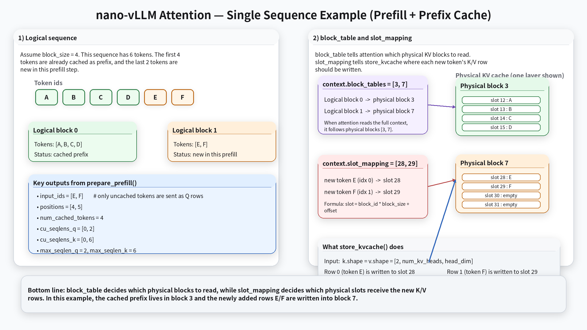

# Lab 3

The goal of Lab 3 is to keep the hand-written Qwen3 model from Lab 2, but stop treating inference as a single-request loop.

This lab shifts the focus from model internals to runtime structure:
- add KV cache storage
- batch multiple active requests together
- schedule prefill and decode separately
- manage cache memory in blocks instead of one flat growing tensor per request

Lab 3 is the first lab that starts to feel like a small vLLM-style runtime rather than a plain demo.

## What You Will Build

From the API point of view, Lab 3 still exposes the same top-level interface:

```python
llm = LLMEngine(model_path)
outputs = llm.generate(
    ["introduce yourself", "list all prime numbers within 100"],
    SamplingParams(temperature=0.6, max_tokens=128),
)
```

What changes is the execution model underneath:
1. multiple requests can be alive at the same time
2. prompt ingestion uses a prefill path
3. token-by-token generation uses a decode path
4. keys and values are stored in a paged KV cache
5. a scheduler decides which sequences run next

## What Changes From Lab 2

Lab 2 still recomputed the full prefix every step for one request at a time. Lab 3 introduces the core runtime ideas that make large-batch serving possible:

- request state becomes richer
- KV cache is persistent across steps
- active requests are grouped into batches
- scheduling and memory management become first-class concerns

This means Lab 3 is no longer just about "how does the transformer forward pass work?" It is about "how does an inference engine keep many requests moving without recomputing everything?"

## Suggested Module Split

### 1. `Sequence`

Responsibility: store request-level runtime state.

Compared with earlier labs, a Lab 3 sequence needs more than just token ids:
- `token_ids`
- `num_cached_tokens`
- `block_table`
- `block_size`
- completion progress and stop conditions

This is the point where a request stops being just an input/output container and becomes a scheduling object.

### 2. `BlockManager`

Responsibility: manage paged KV cache allocation.

Instead of assigning one contiguous cache tensor per request, Lab 3 allocates fixed-size blocks and records which blocks belong to each sequence.

That enables two important ideas:
- requests can grow incrementally during decode
- cache memory can be shared, recycled, and eventually deduplicated

### 3. `Scheduler`

Responsibility: decide which requests run in each step.

The scheduler now has to juggle:
- `waiting` requests that have not entered execution yet
- `running` requests that already own cache blocks
- prefill batches for new prompt tokens
- decode batches for one-token continuation

This is the center of the Lab 3 runtime story. The model is no longer the only thing that matters; queue discipline and memory pressure matter too.

### 4. `ModelRunner`

Responsibility: turn scheduled sequences into actual tensors and execute the model.

For Lab 3, the runner does more than "run one forward pass":
- allocate the KV cache
- prepare block tables
- build prefill inputs
- build decode inputs
- set per-step runtime context
- call flash attention with cache-aware arguments

This is where the scheduler and the model finally meet.

### 5. Cache-Aware Attention

Responsibility: write new K/V tensors into cache and read cached context during attention.

The custom attention layer now needs to support two modes:
- prefill: process uncached prompt chunks, optionally against cached blocks
- decode: attend against the existing KV cache for one-token continuation

That is the main algorithmic jump from Lab 2 to Lab 3.

## End-to-End Data Flow

The key Lab 3 runtime path is:

```text
prompt(s)
  -> tokenizer / token ids
  -> Sequence objects
  -> waiting queue
  -> Scheduler.schedule()
      -> prefill batch or decode batch
  -> ModelRunner.prepare_*
  -> paged KV cache writes / reads
  -> model forward
  -> logits
  -> sampling
  -> Scheduler.postprocess()
      -> append token
      -> finish request or keep running
  -> repeat until all requests finish
```



The most important new mental model is that Lab 3 is no longer a simple "call model, get token" loop. It is a small runtime that continuously moves requests between queues while reusing cached attention state.

## Recommended Implementation Order

If you are filling in the skeleton from scratch, the cleanest order is:

1. Extend `Sequence`
   - add cached-token accounting
   - add block-table helpers

2. Implement `BlockManager`
   - fixed-size blocks
   - allocation and deallocation
   - append-time growth rules

3. Implement the scheduler
   - waiting queue
   - running queue
   - prefill path
   - decode path

4. Implement `ModelRunner`
   - allocate KV cache
   - build prefill/decode tensors
   - wire context into the attention layer

5. Upgrade attention
   - store K/V into paged cache
   - use cache-aware flash attention calls

6. Reconnect everything in `LLMEngine.generate`
   - add requests
   - repeatedly schedule
   - run one batch
   - postprocess finished requests

## What Lab 3 Still Does Not Solve

Even after Lab 3 works, it is still not a full production engine:
- scheduling is still simplified
- preemption behavior is minimal
- there is no multi-GPU support
- there is no advanced sampling stack
- there is no tokenizer-side asynchronous request ingestion

That is fine. The purpose of Lab 3 is to introduce the structural ideas behind a modern inference runtime without drowning in every production detail at once.

## How To Run It

Run the student version:

```bash
make run-lab3
```

Run the reference solution:

```bash
make run-lab3-s
```

Run the benchmark:

```bash
make bench-lab3
make bench-lab3-s
```

## A Simple Mental Model

You can summarize Lab 3 in three sentences:

- Lab 2 rebuilt the model
- Lab 3 rebuilds the runtime around that model
- paged KV cache plus scheduling is what turns single-request decoding into multi-request serving
