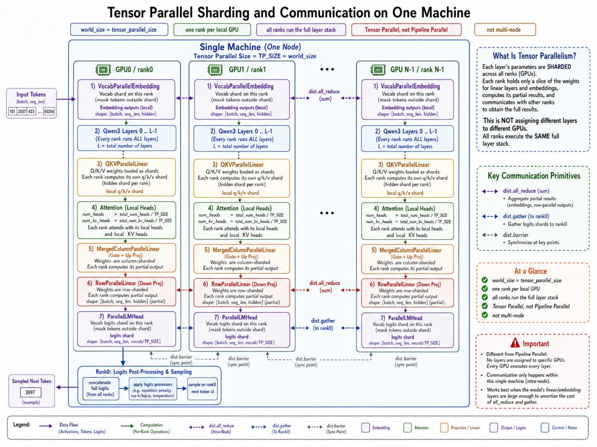

# Lab 5

The goal of Lab 5 is to keep the Lab 4 paged-KV serving engine, but make it work for a larger model by splitting execution across multiple GPUs on one machine with tensor parallelism.

This lab shifts the focus from single-GPU runtime tuning to single-node distributed inference:

- shard model weights across local GPUs
- run one rank per local GPU
- keep the full layer stack on every rank
- communicate partial results with NCCL collectives
- keep the same scheduler, paged KV cache, and decode fast path shape from Lab 4

Lab 5 is the first lab in this repository that uses more than one GPU.

## Scope

Lab 5 is intentionally scoped to:

- single node
- tensor parallel only
- one process per local GPU
- one shared request scheduler on rank 0

It is not:

- multi-node
- data parallel
- pipeline parallel

## What You Will Build

From the API point of view, Lab 5 still exposes the same top-level interface:

```python
llm = LLMEngine(model_path, tensor_parallel_size=2)
outputs = llm.generate(
    ["introduce yourself", "list all prime numbers within 100"],
    SamplingParams(temperature=0.6, max_tokens=128),
)
```

What changes is the execution model underneath:

1. rank 0 starts one worker process per additional GPU
2. all ranks initialize one NCCL process group
3. model weights are sharded across ranks for attention, MLP, embedding, and LM head
4. every rank runs the full decoder layer stack on its own parameter shard
5. partial results are synchronized with `dist.all_reduce` or `dist.gather`

## What Changes From Lab 4

Lab 4 was still a single-GPU engine. Lab 5 keeps most of that runtime structure, but replaces the single-device execution path with a single-node tensor-parallel path:

- `VocabParallelEmbedding` shards the vocab table across ranks
- `QKVParallelLinear` shards attention Q/K/V projections
- `MergedColumnParallelLinear` shards MLP gate/up projections
- `RowParallelLinear` shards attention output and MLP down projections
- `ParallelLMHead` computes vocab-shard logits on each rank and gathers them to rank 0

The scheduler and KV block manager still behave like Lab 4 at the logical level. The major change is that the underlying per-layer math now happens on sharded parameters across ranks.

## Suggested Module Split

### 1. `LLMEngine`

Responsibility: own the request lifecycle and start local TP workers.

In Lab 5, rank 0 still owns:

- tokenizer setup
- request admission
- scheduler loop
- block manager
- final sampling result flow

But it also:

- chooses a local TCP init method
- spawns rank `1..N-1`
- shares control messages with worker ranks through local shared memory and events

### 2. `ModelRunner`

Responsibility: initialize one distributed rank, load the local model shard, and execute prefill/decode for that shard.

Each rank:

- joins the NCCL process group
- binds to `cuda:<rank>`
- loads the same model architecture
- loads only the local parameter shard for TP-aware layers
- allocates only the local KV-cache shard

### 3. TP-Aware Layers

Responsibility: shard the expensive parameter matrices while preserving the same forward graph at the block level.

The main layer families are:

- `VocabParallelEmbedding`
- `QKVParallelLinear`
- `MergedColumnParallelLinear`
- `RowParallelLinear`
- `ParallelLMHead`

The key mental model is:

- all ranks run all layers
- each rank owns only part of the layer weights
- communication is used to reconstruct full logical results

### 4. `Scheduler` and `BlockManager`

Responsibility: keep the same logical request scheduling and block assignment as Lab 4.

These parts remain centralized on rank 0 at the control-plane level.

That means:

- a sequence still has one `block_table`
- a logical block id still means the same thing on every rank
- each rank writes its own KV-head shard into the local physical cache at that block id

### 5. Local Worker IPC

Responsibility: let rank 0 trigger the same runtime step on other local ranks.

In this implementation:

- rank 0 writes commands into shared memory
- worker ranks wait on local events
- workers deserialize the command and run the same method locally

This is one more reason the lab is single-node only.

## End-to-End Data Flow

The key Lab 5 runtime path is:

```text
prompt(s)
  -> tokenizer / token ids on rank 0
  -> Sequence objects
  -> Scheduler.schedule()
  -> rank 0 broadcasts run(...) command to local worker ranks
  -> all ranks build local prefill/decode tensors
  -> all ranks run the full layer stack on local parameter shards
  -> all_reduce / gather at TP synchronization points
  -> rank 0 samples next token ids
  -> Scheduler.postprocess()
  -> repeat until all requests finish
```



## Communication Pattern

The most important collectives are:

- `dist.all_reduce`
  - used when partial outputs from different ranks must be summed
  - examples: vocab-parallel embedding output, row-parallel projections

- `dist.gather`
  - used when rank 0 needs the full concatenated logits across vocab shards
  - example: `ParallelLMHead`

- `dist.barrier`
  - used at key setup and shutdown points

## Recommended Implementation Order

If you are building the solution from a Lab 4 baseline, the cleanest order is:

1. Add local multi-process startup to `LLMEngine`
   - choose an init method
   - spawn one worker per additional GPU

2. Add distributed initialization to `ModelRunner`
   - join NCCL
   - bind `cuda:<rank>`

3. Convert heavy layers to TP-aware layers
   - embedding
   - QKV projection
   - MLP gate/up projection
   - row-parallel output projections
   - LM head

4. Shard the KV cache
   - keep logical block ids the same
   - reduce local KV heads by `world_size`

5. Reuse the Lab 4 scheduler flow
   - same prefill/decode split
   - same request lifecycle
   - same block-table logic

6. Add rank-0 orchestration
   - shared-memory command dispatch
   - rank-0-only sampling

## What Lab 5 Still Does Not Solve

Even after Lab 5 works, it is still not a full distributed serving stack:

- it is not multi-node
- it does not include data parallel replicas
- it does not include pipeline parallel stage partitioning
- it still uses a simplified serving/control plane
- production observability is still intentionally light

That is fine for this repository. The goal is to make single-node tensor parallel inference understandable without jumping straight into a full production distributed runtime.

## How To Run It

Run the solution:

```bash
make run-lab5-s
```

Benchmark the solution:

```bash
make bench-lab5-s
```

Direct entrypoints:

```bash
.venv/bin/python example.py --lab 5 --solution --model ~/huggingface/Qwen3-4B/
.venv/bin/python example.py --lab 5 --solution --model ~/huggingface/Qwen3-4B/ --tensor-parallel-size 1
.venv/bin/python example.py --lab 5 --solution --model ~/huggingface/Qwen3-4B/ --tensor-parallel-size 2
```

`example.py` defaults Lab 5 to:

- model: `~/huggingface/Qwen3-4B/`
- tensor parallel size: `2`

## A Simple Mental Model

You can summarize Lab 5 in three sentences:

- Lab 4 optimized the single-GPU serving loop
- Lab 5 keeps that loop but shards the heavy layers across local GPUs
- the scheduler remains logically central, while model math is distributed across ranks
